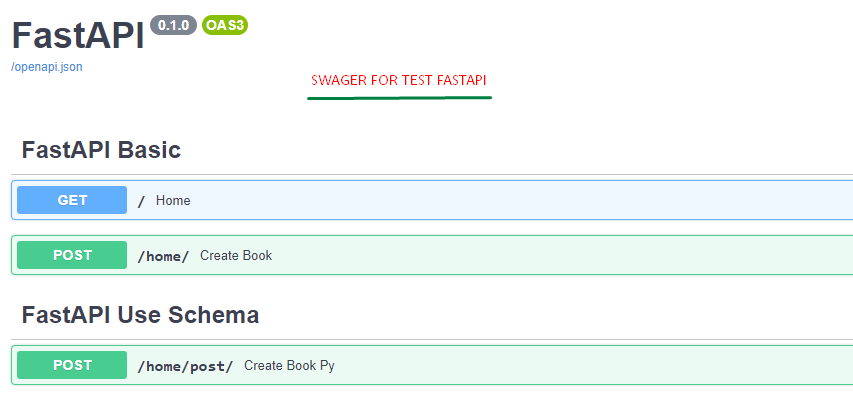
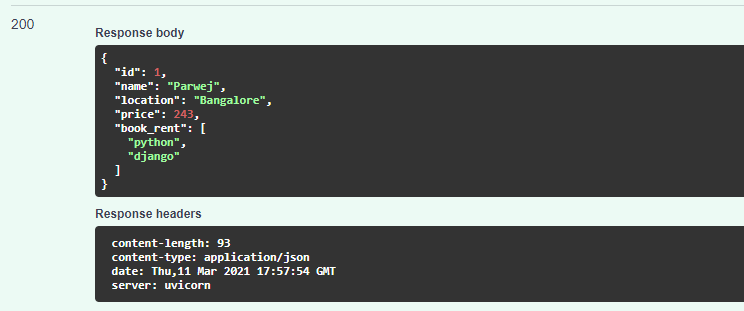
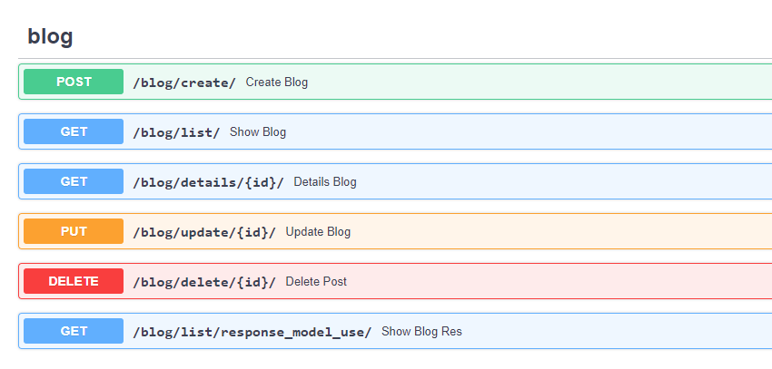
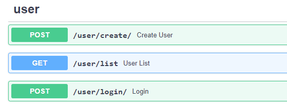
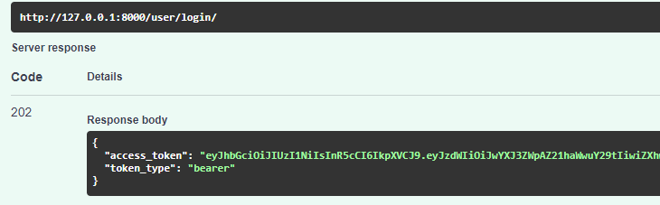
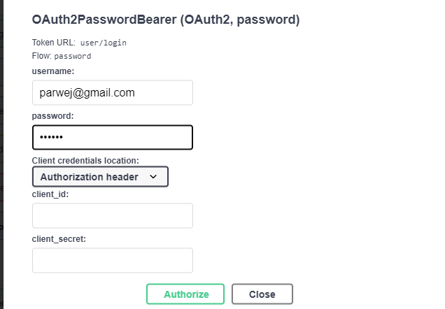
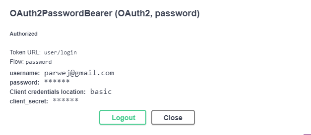
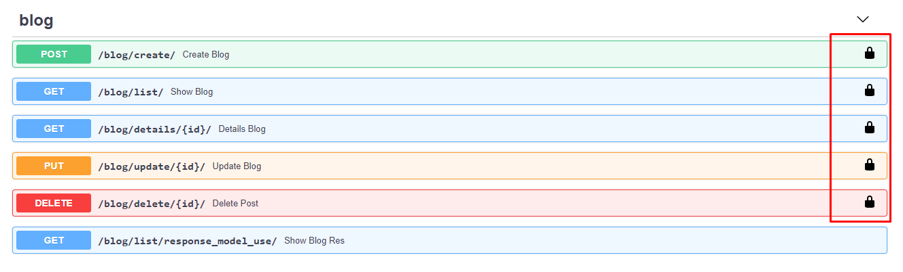
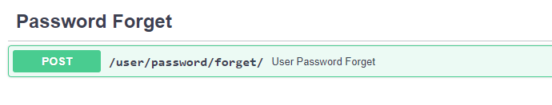

### .. FASTAPI, Pydantic, SqlAlchemy, PostgreSQL, Swager ..
### 1. CRUD operation without database (main.py I written code).
### 2. CRUD operation With PostgreSQL database (blog.py)
### 3. Authentication - registration, login. 
### 4. Token - generate takon for each user after successfully login. 
### 5. use token for access API data.  
### 6. forget password by using Email id.
  

---------------------- <b>CRUD operation without database</b> ----------------------------

  
---------------------- <b>CRUD operation with database</b> ----------------------------

  
---------------------- <b>Authentication - registration, login</b> ----------------------------

  
---------------------- <b>Token - generate takon for each user after successfully login</b>  ----------------------------

  
---------------------- <b>Token - use token for access API data</b> ----------------------------

  
---------------------- <b>Token - use token for access API data</b> ----------------------------

  

### Thank You!

